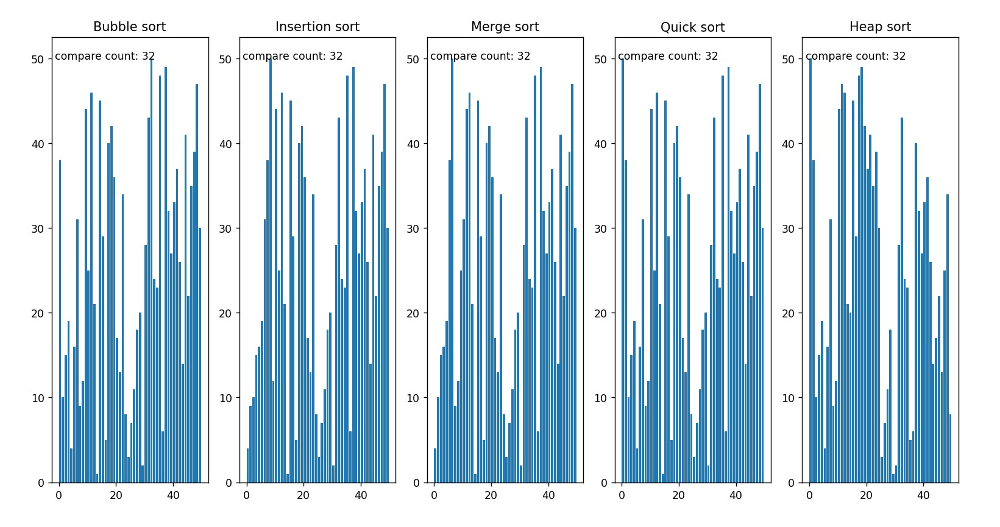

# Sortings_Visual
Visualize the execution of different sorting algorithms and compare their speed. Sorting algorithms considered include bubble sort, insertion sort, merge sort, quick sort, and heap sort.

Usage: Execute the py.

[![Demo Video]](https://youtu.be/Ed9E4hFPFyE)

